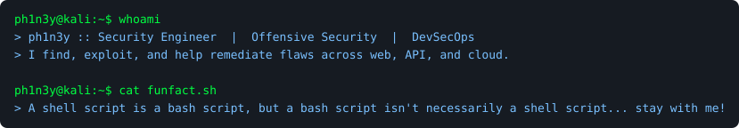
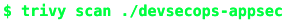

<!-- ═══════════════════════════════════════════════════════════════════════ -->
<!--   THEME: CYBERPUNK TERMINAL  (chosen)                                     -->
<!--   Green cyber vibe throughout; tech LOGOS use real brand colours and are  -->
<!--   sized up (height=30) so they read clearly. Backgrounds stay dark+green. -->
<!--   Real role, tools, and projects; full CV is linked (Download CV) below.   -->
<!--   To use: rename this file to README.md at the repo root.                 -->
<!--   NOTE: add your CV PDF to the repo as Phinehas_Narh_CV.pdf for the link.  -->
<!-- ═══════════════════════════════════════════════════════════════════════ -->

 &nbsp;  &nbsp; 

 &nbsp;&nbsp;  &nbsp;&nbsp;  &nbsp;&nbsp;  &nbsp;&nbsp;  &nbsp;&nbsp;  &nbsp;&nbsp;  &nbsp;&nbsp; 

 &nbsp;&nbsp;  &nbsp;&nbsp;  &nbsp;&nbsp;  &nbsp;&nbsp;  &nbsp;&nbsp;  &nbsp;&nbsp;  &nbsp;&nbsp;  &nbsp;&nbsp; 

 &nbsp;&nbsp;  &nbsp;&nbsp;  &nbsp;&nbsp;  &nbsp;&nbsp;  &nbsp;&nbsp;  &nbsp;&nbsp;  &nbsp;&nbsp;  &nbsp;&nbsp;  &nbsp;&nbsp; 

 &nbsp;&nbsp;  &nbsp;&nbsp;  &nbsp;&nbsp;  &nbsp;&nbsp; 

        

     

---

> Open source security tools I contribute to, study, and build on:

      

<table width="100%"><tr><td align="center"></td><td align="center"></td><td align="center"></td><td align="center"></td><td align="center"></td><td align="center"></td><td align="center"></td></tr></table>
