<!-- ═══════════════════════════════════════════════════════════════════════ -->
<!--   THEME: CYBERPUNK TERMINAL  (chosen)                                     -->
<!--   Green cyber vibe throughout; tech LOGOS use real brand colours and are  -->
<!--   sized up (height=30) so they read clearly. Backgrounds stay dark+green. -->
<!--   Real role, tools, and projects; full CV is linked (Download CV) below.   -->
<!--   To use: rename this file to README.md at the repo root.                 -->
<!--   NOTE: add your CV PDF to the repo as Phinehas_Narh_CV.pdf for the link.  -->
<!-- ═══════════════════════════════════════════════════════════════════════ -->

<div align="center">



 &nbsp;  &nbsp; 

</div>

```bash
ph1n3y@kali:~$ whoami
> ph1n3y :: Security Engineer  |  Offensive Security  |  DevSecOps
> I find, exploit, and help remediate flaws across web, API, and cloud.

ph1n3y@kali:~$ cat funfact.sh
> A shell script is a bash script, but a bash script isn't necessarily a shell script... stay with me!
```

### `$ ls -la ./languages`
       

### `$ nmap -sV ./offensive-security`
        

### `$ trivy scan ./devsecops-appsec`
         

### `$ az login ./cloud-security-operations`
    

### `$ cat ./blue-team-threat-intel-forensics`
        

### `$ cat ./governance-risk-compliance`
     

---

### `$ ls -la ./featured-projects`

- **[Cloud-Audit-101](https://github.com/PhinehasNarh/Cloud-Audit-101)** :: AWS + Azure misconfiguration scanner, 80+ checks across 21 services, mapped to CIS, PCI-DSS v4, ISO 27001, and NIST 800-53. SARIF output plus a shareable HTML dashboard.
- **[Scan-dashboard](https://github.com/PhinehasNarh/Scan-dashboard)** :: Unified AppSec dashboard aggregating Trivy, SonarCloud, Bandit, and secret-scan results across 400+ repo scans in one pane of glass.
- **[Burp-Claude-connector](https://github.com/PhinehasNarh/Burp-Claude-connector)** :: Burp Suite Professional extension (Java, Montoya API) plus a 28-tool MCP server that drives Burp from an AI assistant.
- **[app-pot](https://github.com/PhinehasNarh/app-pot)** :: Web application honeypot that lures and fingerprints attackers, detecting SQLi, XSS, SSRF, SSTI, and command injection.
- **[vuln-console](https://github.com/PhinehasNarh/vuln-console)** :: Self-hosted vulnerability triage and remediation console.
- **[cve-research](https://github.com/PhinehasNarh/cve-research)** :: Incident-response investigation of CVE-2024-4577 (PHP-CGI zero-day), reconstructed from IDS/IPS and web-server logs.

<sub>More: [Anti-Fraud](https://github.com/PhinehasNarh/Anti-Fraud) (ML fraud detection) · [CTI Toolkit](https://github.com/PhinehasNarh/CTI-Cyber-Threat-Intelligence-Toolkit) · [git-collect](https://github.com/PhinehasNarh/git-collect) · [pygen](https://github.com/PhinehasNarh/pygen) · [write-blocker](https://github.com/PhinehasNarh/write-blocker) (C) · [Browser-Trust](https://github.com/PhinehasNarh/Browser-Trust)</sub>

---

### `$ ./stats --render --theme=matrix`

<div align="center">


</div>

### `$ git log --open-source-contributions`
> Open source security tools I contribute to, study, and build on:

[](https://github.com/PhinehasNarh/garak) [](https://github.com/PhinehasNarh/checkov) [](https://github.com/PhinehasNarh/gitleaks) [](https://github.com/PhinehasNarh/mitmproxy) [](https://github.com/PhinehasNarh/nuclei-templates) [](https://github.com/PhinehasNarh/juice-shop) [](https://github.com/PhinehasNarh/cloud-init)

### `$ ./connect --social`

<div align="center">

[](https://linkedin.com/in/phinehasnarh) [](https://x.com/ph1n3y) [](https://instagram.com/ph1n3y) [](https://website-lilac-mu-26.vercel.app/) [](mailto:phinehastettehnarh@gmail.com) [](https://github.com/PhinehasNarh/PhinehasNarh/blob/main/Phinehas_Narh_CV.pdf) [](https://github.com/PhinehasNarh/PhinehasNarh/raw/main/Phinehas_Narh_CV.pdf)

```bash
ph1n3y@kali:~$ exit
> Connection to ph1n3y closed. Stay curious, stay secure.
```

</div>
